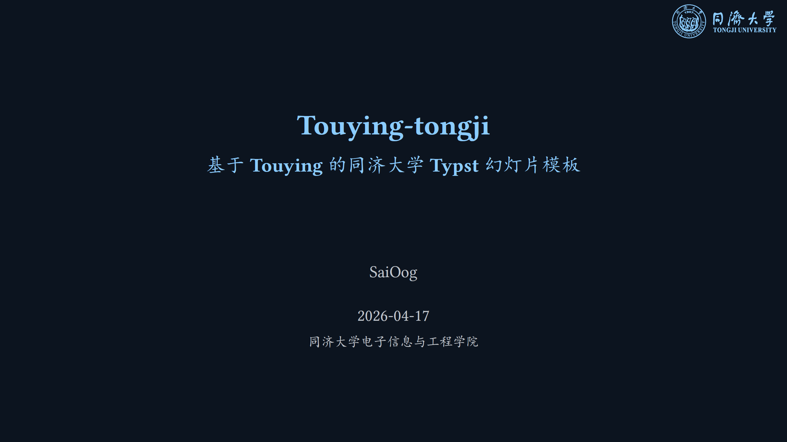

# Touying-Tongji

[中文版](#中文版) | [English version](#english-version)

## 中文版

### 项目简介

`Touying-Tongji` 是一个基于 Typst 与 Touying 的同济大学风格幻灯片模板。它在上游主题的基础上进行了同济化适配，包括主题配色、明暗模式切换、首页与尾页校徽切换、以及示例文档中的 CeTZ/Fletcher 图形演示联动。



### 主要功能与适配内容

模板核心特性是保持 Touying 的演示能力，同时把视觉系统和使用体验改造成更适合同济场景。

- 支持 Light / Dark 模式切换，并基于同济蓝扩展了一组可读性较高的配色。
- 全局页面背景与文字颜色已接入模式映射，正文页、首页、尾页保持一致的色彩逻辑。
- 首页与尾页校徽支持模式切换：Dark 模式使用 `vi/tongji-vi-logo-fordark.svg`。
- 示例中 CeTZ 与 Fletcher 的线条颜色已和主题模式联动，避免 Dark 模式下线条过暗。

### 如何使用

先获取仓库并进入目录，然后编译示例或模板。

```powershell
git clone https://github.com/SaiOogcn/touying-Tongji
Set-Location -Path .\touying-Tongji
typst compile .\examples\main.typ --root .
typst compile .\template\main.typ --root .
```

你也可以直接在 VS Code 配合 TinyMist 打开 `examples/main.typ` 或 `template/main.typ` 进行实时预览与导出。

### 在哪里自定义

日常写作建议从 `template/main.typ` 开始。文稿层面的标题、作者、单位等信息在 `#show: tongji-theme.with(config-info(...))` 中修改。主题层面的统一配置在 `lib.typ`。

如果你要切换明暗模式，在文档入口文件（例如 `examples/main.typ` 或 `template/main.typ`）修改：

```typst
#let deck-mode = "light" // 或 "dark"
#show: tongji-theme.with(
	color-mode: deck-mode,
	config-info(...),
)
```

如果你要自定义各模式颜色，请编辑 `lib.typ` 中 `lzu-theme` 的 `let tonal = if color-mode == "dark" { ... } else { ... }`。主要可调项包括：

- `primary`：标题和强调色
- `surface`：页面背景
- `on-surface`：正文主文字色
- `secondary` / `tertiary` / `quaternary` / `quinary`：扩展强调色

如果你要替换模式下的校徽，修改 `title-slide` 与 `end-slide` 中按 `self.store.color-mode` 分支选择的图片路径。

### 许可

本项目沿用 MIT License，详见 `LICENSE`。

## English version

### Overview

`Touying-Tongji` is a Tongji-styled slide template built on Typst and Touying. It keeps Touying’s presentation workflow while adding Tongji-oriented visual and usability adaptations, including theme palettes, light/dark switching, logo switching for title/end slides, and synced CeTZ/Fletcher demo styles.


### What is adapted

This template provides mode-aware styling instead of static colors.

- Light/Dark mode switching with a Tongji-blue based palette.
- Global page background and body text mapping through theme tonal logic.
- Dark-mode logo switching on title/end slides using `vi/tongji-vi-logo-fordark.svg`.
- CeTZ and Fletcher demo strokes synchronized with mode settings for readability.

### How to use

Clone the repository and compile either the example deck or the starter template.

```powershell
git clone https://github.com/SaiOogcn/touying-Tongji
Set-Location -Path .\touying-Tongji
typst compile .\examples\main.typ --root .
typst compile .\template\main.typ --root .
```

You can also use VS Code with TinyMist for live preview and export.

### Where to customize

For slide content, start from `template/main.typ` and edit `config-info(...)`. For global theme behavior, edit `lib.typ`.

To switch mode in entry files:

```typst
#let deck-mode = "light" // or "dark"
#show: tongji-theme.with(
	color-mode: deck-mode,
	config-info(...),
)
```

To customize colors, edit the tonal mapping in `lib.typ` under `let tonal = if color-mode == "dark" { ... } else { ... }`, especially `primary`, `surface`, `on-surface`, and the accent extensions (`secondary`, `tertiary`, `quaternary`, `quinary`).

### License

This project is released under the MIT License. See `LICENSE` for details.

## 致谢 / Acknowledgements

本项目基于并受益于以下开源项目：

- `sjtug/touying-sjtu`: https://github.com/sjtug/touying-sjtu
- `nftuoa/touying-lzu`: https://github.com/nftuoa/touying-lzu
